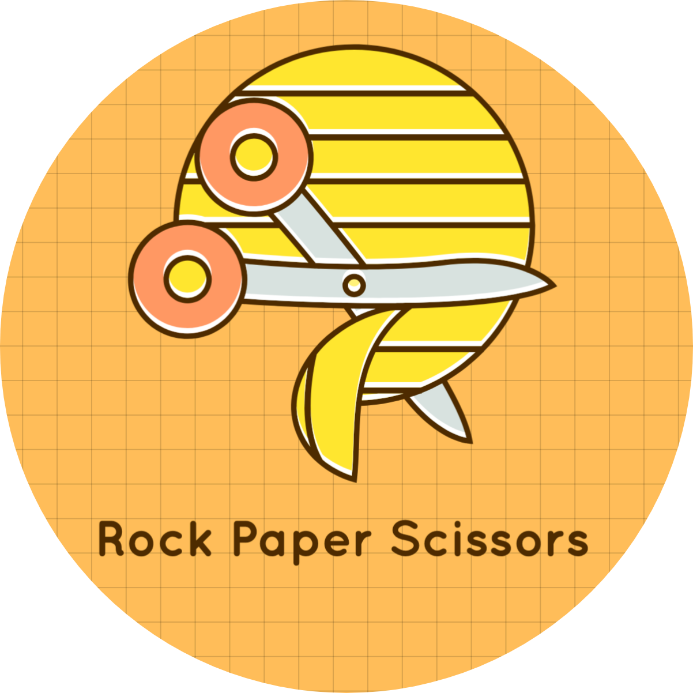
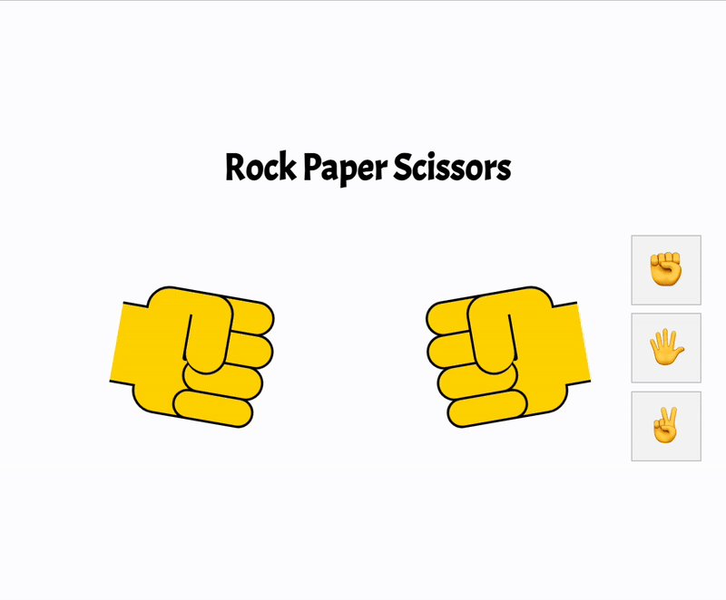

  

<h1 align="center">Rock Paper Scissors</h1>

  

    <h4>리액트 스터디 과제 1: 가위 바위 보 </h4>
    
<strong>기간: 25.04.01 (화)</strong>

  

 

#### Reference
https://codingnoona.thinkific.com/courses/3  
https://codepen.io/alvaromontoro/pen/BaaBYyz

